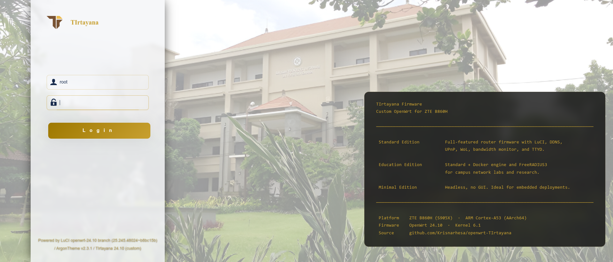
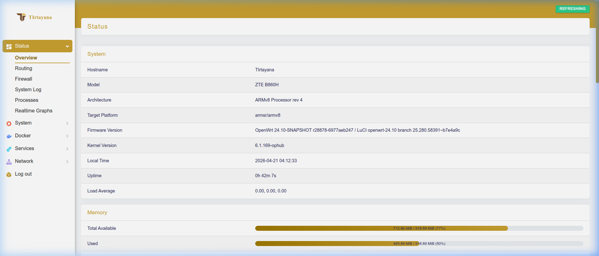
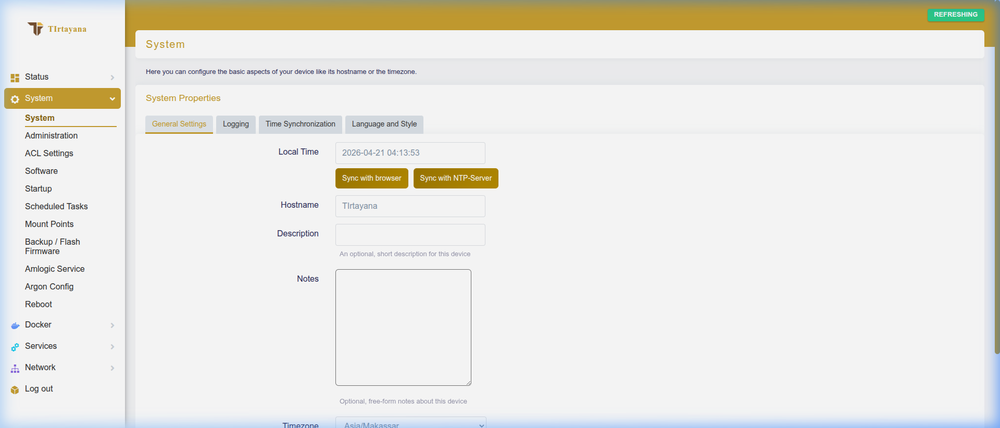

<div align="center">
  <br>

  <b>Custom Firmware for STB B860H (Amlogic S905X)</b>

  [](https://github.com/Krisnarhesa/openwrt-TIrtayana/actions/workflows/build-b860h.yml)
  [](https://opensource.org/licenses/GPL-2.0)
  
  *Dedicated to Computer Network Research & Education - Information Technology, Udayana University*
</div>

---

## Overview

**TIrtayana OpenWrt** is an automated Continuous Integration (CI) repository specifically designed to construct custom firmware for the **STB B860H (Amlogic S905X)** device. This project facilitates the simultaneous compilation of three distinct firmware profiles (*Minimal*, *Standard*, and *Education*) with support for dynamic custom kernel selection, modern user interface ecosystem injection, and integrated **Amlogic Service** management via [luci-app-amlogic](https://github.com/ophub/luci-app-amlogic).

This build employs a hybrid **two-stage** system to ensure maximum reliability and hardware compatibility:
1. **OpenWrt Base Compilation:** Builds a pure root filesystem for the `armsr/armv8` (Generic EFI) architecture.
2. **Firmware Repackaging:** Injects customized Amlogic kernels and hardware bootloaders leveraging the `ophub/amlogic-s9xxx-openwrt` library with a B860H-specific Device Tree Blob (`meson-gxl-s905x-b860h.dtb`).

---

## Key Features

* **Full Automation (CI/CD):** Firmware image production runs directly on GitHub servers, eliminating local computing overhead.
* **Multi-Profile Support:** Three separate compilation configurations (`minimal`, `standard`, `education`) targeting different use cases.
* **Dynamic Kernels:** Each profile uses a different kernel series - configurable both via CI inputs and local build parameters.
* **Custom Argon Theme:** Integrates a modified `luci-theme-argon` featuring a fixed sidebar layout, gold color palette, and premium two-column login page with firmware edition display.
* **Amlogic Service Integration:** Built-in [luci-app-amlogic](https://github.com/ophub/luci-app-amlogic) plugin providing eMMC installation, online firmware/kernel updates, backup/restore, and snapshot management.
* **B860H DTB Support:** Firmware ships with the correct device tree (`meson-gxl-s905x-b860h.dtb`) pre-configured in `uEnv.txt`.
* **Preset Configurations:** Pre-configured IP (`192.168.1.1`), root authentication, custom banners, and network optimizations embedded directly into the base system.

---

## Supported Hardware

| Parameter | Specification |
| :--- | :--- |
| **Model** | ZTE STB B860H |
| **SoC** | Amlogic S905X (Quad-core ARM Cortex-A53 @ 1.5 GHz) |
| **RAM** | 1-2 GB DDR3 |
| **Storage** | 8 GB eMMC |
| **DTB** | `meson-gxl-s905x-b860h.dtb` |
| **Ethernet** | 10/100 Mbps |
| **USB** | 2× USB 2.0 |
| **Video** | HDMI 2.0 |

> **Note:** B860H variants with HiSilicon Hi3798MV200 are **not supported**.

---

## Firmware Editions

Three firmware editions are available, each designed for different use-case requirements.

### Edition Comparison Matrix

| Feature / Package | Minimal | Standard | Education |
| :--- | :---: | :---: | :---: |
| **Administration** | SSH/CLI only | LuCI Web UI | LuCI Web UI |
| **Default Kernel** | `5.15.y` | `6.1.y` | `6.6.y` |
| **Argon-Tirtayana Theme** | ✗ | ✓ | ✓ |
| **Amlogic Service (ophub)** | ✗ | ✓ | ✓ |
| **Firewall (nftables)** | ✓ | ✓ | ✓ |
| **DHCP/DNS (dnsmasq)** | ✓ | ✓ | ✓ |
| **PPPoE Support** | ✓ | ✓ | ✓ |
| **SSH Server (dropbear)** | ✓ | ✓ | ✓ |
| **USB Storage Support** | ✗ | ✓ | ✓ |
| **iproute2 / iptables** | ✗ | ✓ | ✓ |
| **Monitoring (htop, nstat)** | ✗ | ✓ | ✓ |
| **tcpdump** | ✗ | ✓ | ✓ |
| **bash / coreutils** | ✗ | ✓ | ✓ |
| **nmap** | ✗ | ✗ | ✓ |
| **iperf3** | ✗ | ✗ | ✓ |
| **curl / wget-ssl** | ✗ | ✗ | ✓ |
| **OpenVPN** | ✗ | ✗ | ✓ |
| **WireGuard** | ✗ | ✗ | ✓ |
| **Captive Portal (nodogsplash)** | ✗ | ✗ | ✓ |
| **RADIUS (freeradius3)** | ✗ | ✗ | ✓ |
| **Docker / Dockerman** | ✗ | ✗ | ✓ |

---

### Minimal Edition

Lightweight firmware providing essential routing and network functions only. **No web interface** - all administration is via SSH/CLI. Ideal for production routers requiring maximum performance with minimum footprint.

| Package Group | Packages | Description |
| :--- | :--- | :--- |
| **Base system** | `busybox`, `procd`, `ubus`, `uci`, `logd` | Core system, process management, UCI config |
| **Network** | `netifd`, `firewall4`, `dnsmasq`, `odhcpd` | Interface management, nftables firewall, DHCP/DNS |
| **Remote access** | `dropbear` | SSH server for CLI administration |
| **PPP** | `ppp`, `ppp-mod-pppoe` | PPPoE ISP connectivity |
| **Filesystem** | `e2fsprogs`, `mkf2fs`, `blkid`, `fstools` | Disk management for eMMC/USB storage |
| **Security** | `ca-bundle`, `usign`, `urngd` | TLS certificates, package signing, entropy |

> **Kernel:** `5.15.y` (LTS - maximum stability, lowest resource usage)

---

### Standard Edition

Balanced firmware with full web administration, network monitoring tools, Amlogic device management, and the custom Argon-Tirtayana theme. Recommended for most users.

| Package Group | Packages | Description |
| :--- | :--- | :--- |
| **All Minimal packages** | *(inherited)* | Core system + networking |
| **Web management** | `luci`, `luci-base`, `uhttpd`, `luci-mod-admin-full`, `luci-mod-network`, `luci-mod-status`, `luci-mod-system` | Full LuCI web admin interface |
| **Custom theme** | `luci-theme-argon`, `luci-app-argon-config` | Branded sidebar UI with gold palette |
| **Amlogic Service** | `luci-app-amlogic`, `luci-compat`, `perl` | eMMC install, firmware update, backup/restore |
| **Firewall UI** | `luci-app-firewall` | Visual firewall rule management |
| **Package manager** | `luci-app-package-manager` | Install/remove packages from LuCI |
| **Network utilities** | `iproute2`, `iptables-nft`, `nstat`, `tcpdump` | Advanced routing, traffic analysis |
| **System utilities** | `coreutils`, `htop`, `bash` | Enhanced shell and process monitoring |
| **USB storage** | `kmod-usb-core`, `kmod-usb-storage`, `block-mount` | USB drive hot-plug support |
| **Protocol support** | `luci-proto-ipv6`, `luci-proto-ppp` | IPv6 and PPP protocol integration |

> **Kernel:** `6.1.y` (LTS - balanced stability and hardware support)

---

### Education Edition (Table 3.8)

Full-featured firmware with all Standard packages plus advanced networking, security, and containerization tools. Designed for campus/laboratory environments, network research, and experimentation.

| Package Group | Packages | Description |
| :--- | :--- | :--- |
| **All Standard packages** | *(inherited)* | Full LuCI + monitoring + Amlogic service |
| **Network testing** | `nmap`, `iperf3`, `curl`, `wget-ssl` | Network scanning, bandwidth testing, HTTP tools |
| **VPN & security** | `openvpn-openssl`, `wireguard-tools` | Secure VPN tunnel connectivity |
| **Access control** | `nodogsplash` | Captive portal for guest/student networks |
| **RADIUS auth** | `freeradius3`, `freeradius3-utils` | Centralized 802.1X / WPA-Enterprise authentication |
| **Traffic analysis** | `tcpdump` | Deep packet capture and analysis |
| **Containerization** | `docker`, `dockerd`, `luci-app-dockerman` | Container runtime + LuCI management UI |
| **Extended rootfs** | `CONFIG_TARGET_ROOTFS_PARTSIZE=512` | Larger root partition for Docker images |

> **Kernel:** `6.6.y` (Latest - newest drivers, security patches, experimental features)

---

## Kernel Version Strategy

Each firmware edition uses a different Linux kernel series, balancing stability vs. feature availability:

| Edition | Default Kernel | Rationale | Override Available |
| :--- | :---: | :--- | :---: |
| **Minimal** | `5.15.y` | Long-term support, minimal resource usage, proven stability | ✓ |
| **Standard** | `6.1.y` | LTS with modern driver support, recommended for production | ✓ |
| **Education** | `6.6.y` | Latest features, newest hardware support, experimental | ✓ |

### How to Override Kernel Version

**Via GitHub Actions (CI):**
1. Go to **Actions** → **Build TIrtayana OpenWrt for B860H** → **Run workflow**
2. Set `Override Kernel` to your desired version (e.g. `6.1.y`, `6.6.y`, or `5.15.y_6.1.y` for multiple)
3. This overrides the per-profile default for **all** profiles in this run

**Via Local Build (Manual):**
```bash
# Build standard profile with specific kernel
sudo ./scripts/pack-b860h.sh -c -p standard -k 6.6.y

# Build education profile with multiple kernels
sudo ./scripts/pack-b860h.sh -c -p education -k "6.1.y_6.6.y"

# Build minimal with custom kernel repository
sudo ./scripts/pack-b860h.sh -c -p minimal -k 5.15.y -R "https://github.com/user/repo"
```

---

## Amlogic Service Integration

The firmware ships with [luci-app-amlogic](https://github.com/ophub/luci-app-amlogic) pre-installed (Standard & Education editions), accessible via **System → Amlogic Service** in the LuCI web interface.

| Feature | Description |
| :--- | :--- |
| **Install to eMMC** | Write firmware from USB/SD to built-in eMMC storage |
| **Online Update** | Download and apply firmware/kernel updates from GitHub Releases |
| **Manual Upload** | Upload firmware or kernel files directly for local update |
| **Backup/Restore** | Save and restore OpenWrt configuration snapshots |
| **Snapshot Management** | Create, manage, and restore system snapshots |
| **CPU Settings** | View CPU information and adjust performance parameters |

---

## Custom Theme: Argon-Tirtayana

Available on Standard and Education editions. A custom LuCI theme based on [luci-theme-argon](https://github.com/jerrykuku/luci-theme-argon):

* **Branded login page** - login form on the left with TIrtayana logo; firmware info panel on the right showing edition descriptions, platform specs, and repository link
* **Custom wallpaper** - Udayana University campus background with frosted glass overlay
* **Gold color palette** (`#c8a030` primary, `#9e7800` dark) replacing default blue across all UI elements - buttons, sidebar, progress bars, and form accents
* **Sidebar branding** - TIrtayana SVG icon + brand text with collapsible navigation
* **Light/Dark mode** - full support with sidebar text contrast auto-adjustment
* **Branded footer** - clickable GitHub links to LuCI, Argon Theme, and TIrtayana repository on both login and dashboard pages

### UI Preview

**Login Page**



**Dashboard**



**System Configuration**



---

## Quick Start Guide

### Building via GitHub Actions (Recommended)

1. Navigate to **[Actions](../../actions)** → **Build TIrtayana OpenWrt for B860H**
2. Click **Run workflow** and configure:

   | Parameter | Options | Default |
   | :--- | :--- | :--- |
   | Build Profile | `all`, `minimal`, `standard`, `education` | `all` |
   | Override Kernel | e.g. `6.1.y`, `6.6.y`, leave empty for per-profile default | *(empty)* |
   | Default IP | Any valid IP | `192.168.1.1` |
   | RootFS Size | Partition size in MB | `1024` |
   | Custom Kernel Repo | GitHub URL to custom kernel source | *(empty)* |

3. Wait ~1–2 hours for compilation. Download `.img.gz` from **Releases**.

### Installation on B860H

1. Extract `.img.gz` and flash to USB/SD (≥4 GB) using **BalenaEtcher** or **Rufus**
2. Insert into STB B860H and power on
3. Access admin panel:
   - **URL:** `http://192.168.1.1`
   - **Username:** `root`
   - **Password:** `TIudayana`
4. *(Recommended)* Install to eMMC: **System → Amlogic Service → Install OpenWrt** → Select `B860H` → **Install**

> **Minimal edition** has no web UI - use SSH: `ssh root@192.168.1.1`

### DTB Configuration

The firmware is pre-configured with the correct Device Tree Blob for B860H:
```
FDT=/dtb/amlogic/meson-gxl-s905x-b860h.dtb
```
This is automatically injected into `uEnv.txt` during packaging by both `pack-b860h.sh` (local) and the GitHub Actions workflow (CI).

---

## Local Build (Manual Compilation)

### System Dependencies

```bash
sudo apt-get update && sudo apt-get full-upgrade -y
sudo apt-get install build-essential clang flex bison g++ gawk gcc-multilib \
  g++-multilib gettext git libncurses5-dev libssl-dev python3-distutils \
  rsync unzip zlib1g-dev dwarves -y
```

### Clone & Build

```bash
git clone -b openwrt-Tirtayana https://github.com/Krisnarhesa/openwrt-TIrtayana.git
cd openwrt-TIrtayana
```

### Build Commands

```bash
# Build Standard edition with default kernel (6.1.y)
sudo ./scripts/pack-b860h.sh -c -p standard

# Build Education edition with kernel 6.6.y
sudo ./scripts/pack-b860h.sh -c -p education -k 6.6.y

# Build Minimal edition with kernel 5.15.y
sudo ./scripts/pack-b860h.sh -c -p minimal -k 5.15.y

# Package only (skip recompilation, reuse existing rootfs)
sudo ./scripts/pack-b860h.sh -p standard -k 6.1.y

# View all options
./scripts/pack-b860h.sh -h
```

### Build Script Parameters

| Flag | Description | Default |
| :--- | :--- | :--- |
| `-c` | Recompile OpenWrt before packaging | *(off)* |
| `-p` | Build profile (`minimal` / `standard` / `education`) | - |
| `-k` | Kernel version (e.g. `6.1.y`, `6.6.y`, or `6.1.y_6.6.y`) | `6.1.y_6.6.y` |
| `-i` | Default IP address | `192.168.1.1` |
| `-s` | Partition sizes BOOT/ROOT in MB | `256/1024` |
| `-b` | Target board | `s905x` |
| `-n` | Builder name | `TIrtayana` |
| `-R` | Custom kernel repository URL | - |
| `-o` | Output directory | `out/b860h` |

---

## Project Structure

```
openwrt-TIrtayana/
├── .config.minimal          # Minimal config — Table 3.6 (base + network, no LuCI)
├── .config.standard         # Standard config — Table 3.7 (full LuCI + monitoring)
├── .config.education        # Education config — Table 3.8 (VPN, RADIUS, Docker)
├── feeds.conf.default       # Package feeds (includes ophub/luci-app-amlogic)
├── files/
│   ├── etc/config/system    # Hostname, timezone, NTP preset
│   ├── etc/amlogic_model.conf  # B860H DTB + board identification
│   └── etc/uci-defaults/    # First-boot scripts (banner, password, theme)
├── scripts/
│   └── pack-b860h.sh        # Local build & packaging script
├── package/
│   ├── luci-theme-argon/            # Custom Argon theme (gold palette)
│   └── luci-app-argon-config/       # Argon theme configuration plugin
└── .github/workflows/
    └── build-b860h.yml      # GitHub Actions CI/CD workflow
```

---

## Licensing and Acknowledgements

Released under [GPL-2.0](https://opensource.org/licenses/GPL-2.0).

| Project | Role |
| :--- | :--- |
| [OpenWrt](https://openwrt.org) | Base firmware framework |
| [ophub/amlogic-s9xxx-openwrt](https://github.com/ophub/amlogic-s9xxx-openwrt) | Amlogic kernel packaging & repackaging |
| [ophub/luci-app-amlogic](https://github.com/ophub/luci-app-amlogic) | Amlogic device management plugin |
| [jerrykuku/luci-theme-argon](https://github.com/jerrykuku/luci-theme-argon) | Base theme framework |

---

<br>
<div align="center">
  <b>TIrtayana OpenWrt</b> - Modern Networking Ecosystem<br>
  Final Project · Teknologi Informasi, Universitas Udayana
</div>